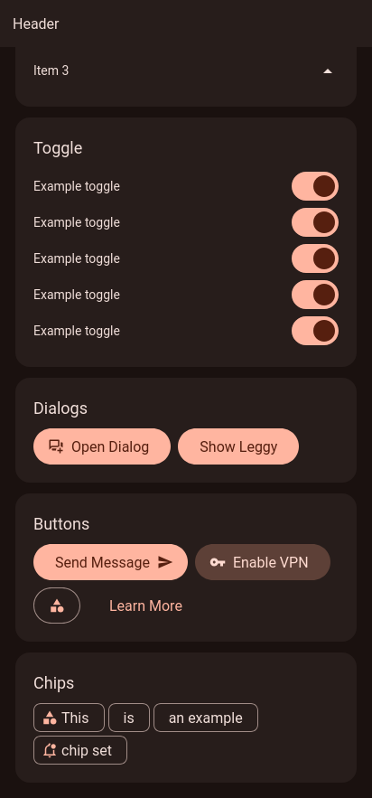
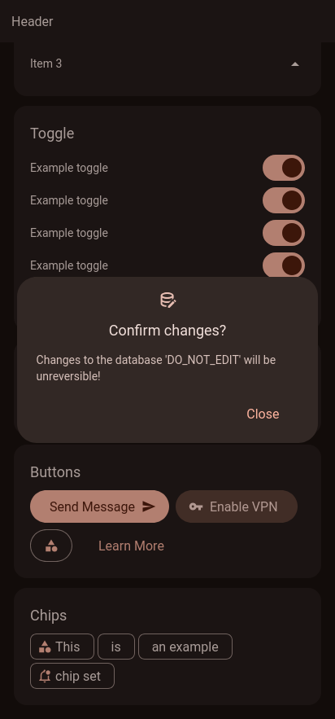

# m3 Svelte

## Warning
> [!CAUTION]
> DO NOT USE YET!!!! This is mostly a test. But, I do hopefully want to get this into a
> `you can use this as a library for svelte apps + capacitor or whatever` levels of quality at some point

## Why
I like material design, and wanted to try and make some components in svelte for practice, more-or-less.

## Screenshots

## ToDos
Following the list of components mentioned in https://m3.material.io/components.

 - [ ] Bottom App Bar
 - [ ] Top App Bar
 - [ ] Badges
 - [ ] Buttons
 - [ ] Cards
 - [ ] Carousels
 - [ ] Chips
 - [ ] Date Pickers
 - [ ] Dialogs
 - [x] Divider
 - [ ] Lists
 - [ ] Menus
 - [ ] Navigation Bar (Bottom Bar?)
 - [ ] Navigation Draw
 - [ ] Navigation Rail
 - [ ] Progress Indicators
 - [ ] Radio Buttons
 - [ ] Search
 - [ ] Bottom Sheet
 - [ ] Side Sheet (Navigation Draw?)
 - [ ] Sliders
 - [ ] Snackbar
 - [ ] Switch
 - [ ] Tabs
 - [ ] Text Fields
 - [ ] Time Pickers
 - [ ] Tooltips
